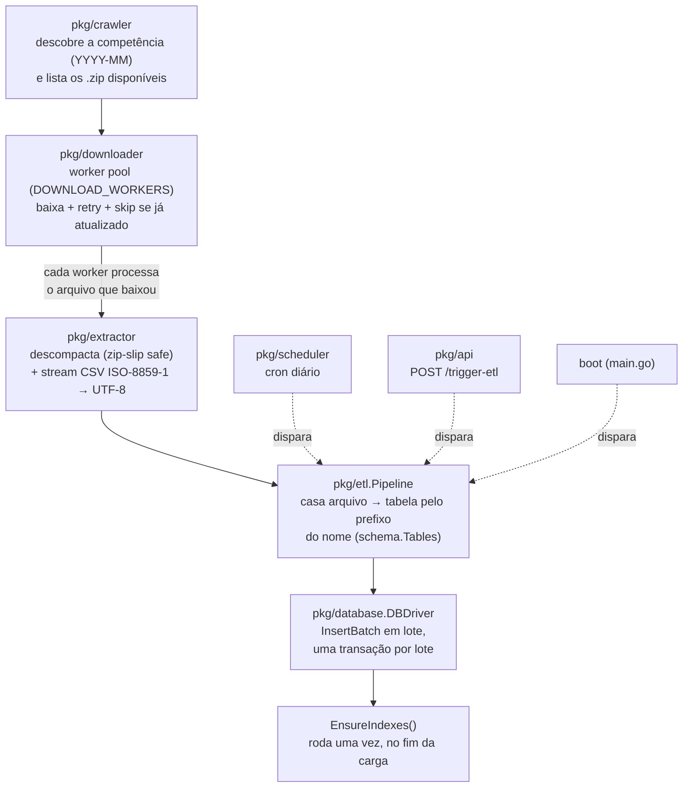
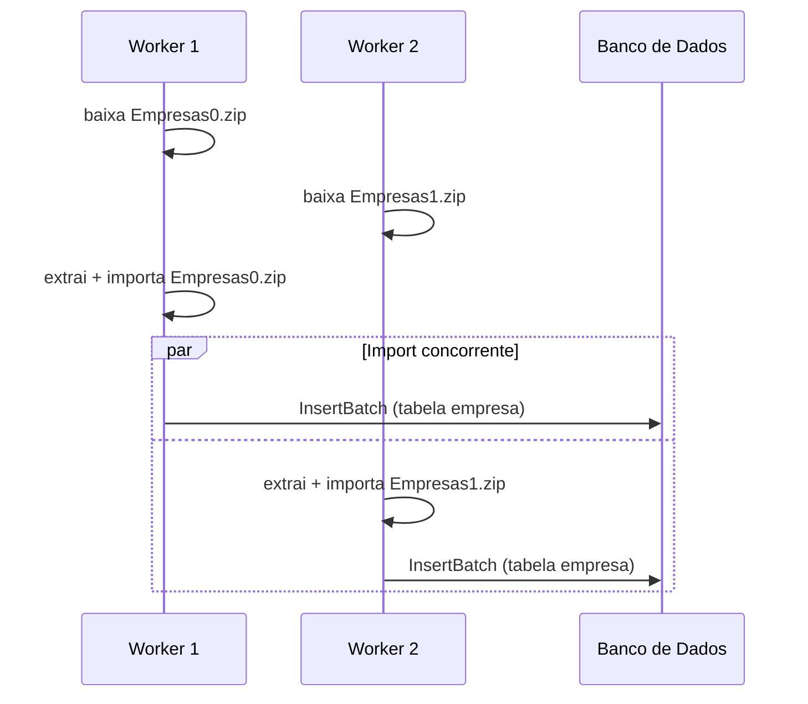

# Arquitetura

Este documento descreve como as peças do projeto se encaixam. Para configuração e uso, veja o [README](../README.md).

## Visão geral do pipeline



Boot, cron e trigger manual da API podem, em teoria, disparar `Pipeline.Run()` ao mesmo tempo — um `atomic.Bool` em `pkg/etl/pipeline.go` garante que só uma execução roda por vez; as demais são recusadas com um log explicativo em vez de rodar em paralelo e disputar os mesmos arquivos.

## Paralelismo dentro de uma execução

Diferente de uma primeira leitura ingênua do código, o download **não** termina antes da importação começar. `Downloader.DownloadStream` mantém um pool de `DOWNLOAD_WORKERS` goroutines lendo de um canal de tarefas; assim que um worker termina de baixar seu arquivo, ele mesmo o descompacta e importa, sem lock global entre workers:



Isso é seguro porque:
- `*sql.DB` é seguro para uso concorrente por múltiplas goroutines (é um pool gerenciado pelo driver).
- Cada `InsertBatch` abre sua própria transação — não há estado mutável compartilhado entre chamadas concorrentes.
- Cada arquivo é extraído para uma subpasta própria (`ExtractedDir/<nome-do-arquivo>/`), evitando colisão de nomes entre arquivos processados ao mesmo tempo.
- Bancos com uma única conexão (SQLite, via `db.SetMaxOpenConns(1)`) naturalmente serializam as transações através do próprio pool — sem precisar de nenhum lock explícito no código.

## Pacotes

| Pacote | Responsabilidade |
|---|---|
| `cmd/cnpj-etl` | Ponto de entrada: parseia flags (`--once`), carrega config, conecta no banco, inicializa schema, sobe o servidor HTTP e o scheduler. |
| `pkg/config` | Lê e valida variáveis de ambiente (`.env`); falha rápido se `API_TOKEN`/`DB_PASSWORD` obrigatórios estiverem ausentes. |
| `pkg/crawler` | Fala WebDAV com o compartilhamento Nextcloud da Receita Federal (`PROPFIND`, com fallback para `GET`); descobre a competência mais recente e lista os `.zip` de um mês. |
| `pkg/downloader` | Worker pool de download HTTP com retry exponencial simples e skip por `Content-Length` (não baixa de novo se o arquivo local já bate com o remoto). |
| `pkg/extractor` | Extrai `.zip` (com proteção contra zip-slip) e faz streaming de CSV, decodificando `ISO-8859-1` → `UTF-8` linha a linha via `csv.Reader`. |
| `pkg/schema` | Define as tabelas/colunas do domínio (`schema.Tables`) — usado tanto para gerar o DDL de cada driver quanto para casar um arquivo extraído com sua tabela de destino pelo prefixo do nome. |
| `pkg/database` | Interface `DBDriver` + implementações concretas (Postgres, MySQL, SQLite, ClickHouse). Cada driver decide seu próprio `BatchLimit` e como criar índices via `EnsureIndexes`. |
| `pkg/etl` | Orquestra crawler → downloader → extractor → database em `Pipeline.Run()`; dono do lock de execução única. |
| `pkg/api` | Servidor HTTP: middleware de autenticação, handlers REST, broadcaster de Server-Sent Events para o console de logs do dashboard. |
| `pkg/web` | Dashboard estático (HTML/CSS/JS) embutido no binário via `go:embed` — não depende de arquivos externos em produção. |
| `pkg/scheduler` | Encapsula `robfig/cron` para disparar `Pipeline.Run()` na expressão configurada em `CRON_SCHEDULE`. |

## A interface `DBDriver`

Todo banco suportado implementa a mesma interface (`pkg/database/driver.go`):

```go
type DBDriver interface {
	Connect() error
	Close() error
	InitSchema() error
	EnsureIndexes() error
	BatchLimit(numCols int) int
	GetLatestProcessedMonth() (string, error)
	SaveProcessedMonth(month string) error
	IsFileProcessed(dataMonth string, filename string) (bool, error)
	SaveProcessedFile(dataMonth string, filename string, status string) error
	InsertBatch(table schema.TableSpec, rows [][]string) error
	GetCNPJ(cnpj string) (map[string]interface{}, error)
	SearchCNPJ(query string, uf string, limit int) ([]map[string]interface{}, error)
	GetStats() (map[string]interface{}, error)
}
```

Dois pontos que não são óbvios de fora:

- **`InitSchema` cria tabelas, mas não os índices secundários.** Índices são responsabilidade de `EnsureIndexes`, chamado pelo pipeline só depois que a carga termina — criar índice antes de carregar dados faz o banco manter esse índice atualizado a cada `INSERT`, o que é o maior fator de lentidão em uma carga em massa do zero.
- **`BatchLimit` não é um número fixo.** Drivers que fazem `INSERT` multi-linha com um placeholder por célula (Postgres, SQLite, e o fallback do MySQL) precisam limitar o lote para não estourar o teto de placeholders da conexão. O MySQL, enquanto `LOAD DATA LOCAL INFILE` estiver disponível, não tem essa restrição (é texto streamado, não usa `?`), então usa `BatchSize` diretamente. Ver a seção de Performance no [README](../README.md#performance) para a fórmula completa.

## Adicionando um novo driver de banco

Veja [`CONTRIBUTING.md`](../CONTRIBUTING.md#adicionando-um-novo-driver-de-banco).
