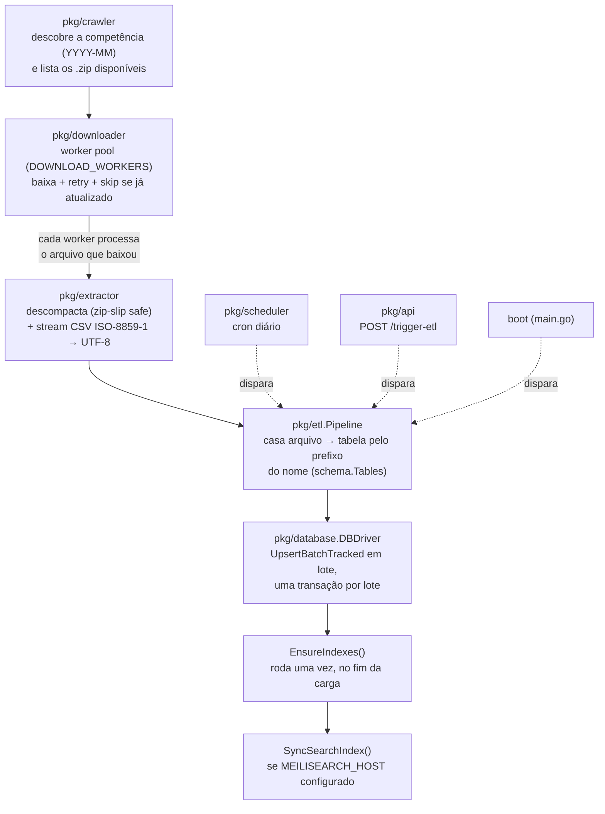
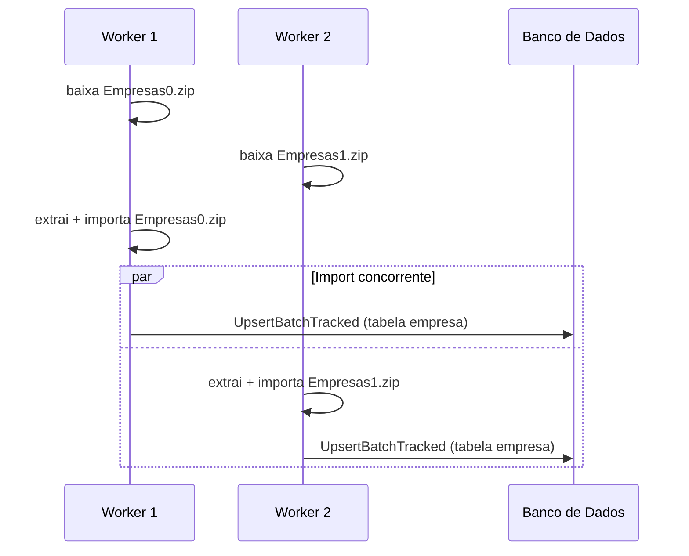
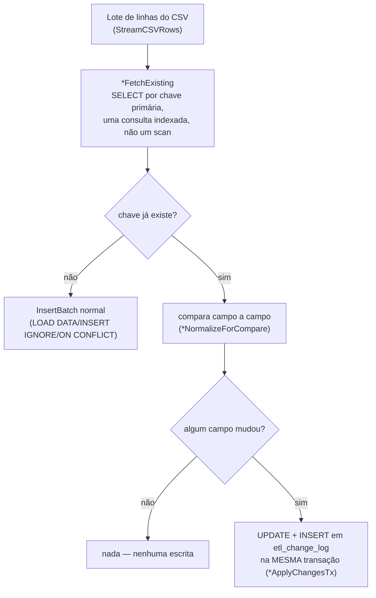
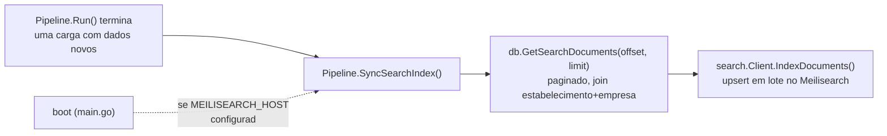

# Arquitetura

Este documento descreve como as peças do projeto se encaixam. Para configuração e uso, veja o [README](../README.md).

## Visão geral do pipeline



Boot, cron e trigger manual da API podem, em teoria, disparar `Pipeline.Run()` ao mesmo tempo — `pkg/lock` garante que só uma execução roda por vez; as demais são recusadas com um log explicativo em vez de rodar em paralelo e disputar os mesmos arquivos. Ver [Lock de execução do pipeline](#lock-de-execução-do-pipeline-pkglock) abaixo.

## Paralelismo dentro de uma execução

Diferente de uma primeira leitura ingênua do código, o download **não** termina antes da importação começar. `Downloader.DownloadStream` mantém um pool de `DOWNLOAD_WORKERS` goroutines lendo de um canal de tarefas; assim que um worker termina de baixar seu arquivo, ele mesmo o descompacta e importa, sem lock global entre workers:



Isso é seguro porque:
- `*sql.DB` é seguro para uso concorrente por múltiplas goroutines (é um pool gerenciado pelo driver).
- Cada `UpsertBatchTracked`/`InsertBatch` abre sua própria transação — não há estado mutável compartilhado entre chamadas concorrentes.
- Cada arquivo é extraído para uma subpasta própria (`ExtractedDir/<nome-do-arquivo>/`), evitando colisão de nomes entre arquivos processados ao mesmo tempo.
- Bancos com uma única conexão (SQLite, via `db.SetMaxOpenConns(1)`) naturalmente serializam as transações através do próprio pool — sem precisar de nenhum lock explícito no código.

## Histórico de mudanças (`UpsertBatchTracked`)

A Receita Federal publica um **snapshot completo** todo mês, não um diff — o `Empresas0.zip` de setembro tem todas as empresas de novo, não só as que mudaram. Um `INSERT IGNORE`/`ON CONFLICT DO NOTHING` (o que `InsertBatch` sempre fez) trata isso descartando silenciosamente qualquer CNPJ que já existe: só empresas genuinamente novas entram, e uma empresa existente que mudou de endereço, situação cadastral, capital social etc. nunca reflete isso no banco — a linha antiga fica congelada na primeira vez que foi importada.

`UpsertBatchTracked` (interface em `pkg/database.DBDriver`, implementado de verdade para MySQL e Postgres hoje — mesma arquitetura nos dois, só muda o dialeto SQL: `mysqlFetchExisting`/`postgresFetchExisting`, `mysqlApplyChangesTx`/`postgresApplyChangesTx`) resolve isso comparando cada linha recebida com o que já está no banco, ao invés de descartar por padrão:



Pontos de design:

- **Só as tabelas com chave natural estável são rastreadas** — `empresa`, `estabelecimento` (chave composta `cnpj_basico`+`cnpj_ordem`+`cnpj_dv`) e `simples`. `socios` fica de fora: o layout da Receita não dá uma chave única natural pra ela, e o schema atual nem define `PRIMARY KEY` nessa tabela em nenhum dos dois drivers — rastrear mudanças aí exige uma decisão de chave composta e uma migração de dedupe pro que já foi importado sem chave nenhuma. Tabelas de domínio (`cnae`, `municipio`, etc.) e drivers sem `UpsertBatchTracked` implementado (SQLite, ClickHouse) caem de volta pro `InsertBatch` de sempre, sem tracking.
- **A comparação é uma consulta indexada, não um scan.** `*FetchExisting` faz `SELECT ... WHERE chave IN (...)` contra a chave primária — isso não fica mais lento conforme a tabela cresce, é sempre uma busca por índice.
- **Linhas idênticas custam só a consulta de comparação — nenhuma escrita.** É isso que mantém uma carga mensal "leve": a maioria das empresas não muda de uma competência pra outra, então a maior parte do lote não gera `UPDATE` nem entrada de log, só o `SELECT` inicial.
- **UPDATE e log de mudança são atômicos — a mesma transação.** Uma versão inicial disso (no MySQL) fazia as duas coisas em transações separadas; um erro no `INSERT` do log depois do `UPDATE` já commitado deixava o dado mudado **sem nenhum registro do que aconteceu** — verificado ao vivo (um `Table doesn't exist` no log chegou a alterar de verdade uma linha de produção antes de ser corrigido). `*ApplyChangesTx` (MySQL e Postgres, desde o início nesse último) faz as duas coisas numa transação só: ou os dois acontecem, ou nenhum acontece.
- **A comparação usa a mesma normalização do insert** (`*NormalizeForCompare` espelha `sanitizeValueMySQL`/`sanitizeValuePostgres`): vírgula vira ponto em `NUMERIC`, formata com 2 casas decimais pra bater com o que `DECIMAL(15,2)`/`NUMERIC(15,2)` de fato armazenam, e trata string vazia como `NULL` dos dois lados. Sem isso, diferenças de formatação (não de conteúdo) gerariam entradas de log falsas todo mês.
- **Histórico é por `cnpj_basico`, não por CNPJ completo** — `etl_change_log.cnpj_basico` tem só os 8 dígitos, compartilhados entre `empresa` e todos os `estabelecimento`/filiais daquele CNPJ. `GET /api/v1/cnpj/{cnpj}/historico` (ver [`docs/API.md`](API.md)) consulta por esse prefixo.
- **A validação do Postgres rodou contra uma instância `postgres:15` isolada** (criada e destruída só para o teste, dados sintéticos), cobrindo os mesmos casos do MySQL (linha nova, reimport sem mudança, mudança em tabela de chave simples e em chave composta) — mas não contra um dataset real de dezenas de milhões de linhas como o MySQL foi.

## Pacotes

| Pacote | Responsabilidade |
|---|---|
| `cmd/cnpj-etl` | Ponto de entrada: parseia flags (`--once`), carrega config, conecta no banco, inicializa schema, sobe o servidor HTTP e o scheduler. |
| `pkg/config` | Lê e valida variáveis de ambiente (`.env`); falha rápido se `API_TOKEN`/`DB_PASSWORD` obrigatórios estiverem ausentes. |
| `pkg/crawler` | Fala WebDAV com o compartilhamento Nextcloud da Receita Federal (`PROPFIND`, com fallback para `GET`); descobre a competência mais recente e lista os `.zip` de um mês. |
| `pkg/downloader` | Worker pool de download HTTP com retry exponencial simples e skip por `Content-Length` (não baixa de novo se o arquivo local já bate com o remoto). |
| `pkg/extractor` | Extrai `.zip` (com proteção contra zip-slip) e faz streaming de CSV, decodificando `ISO-8859-1` → `UTF-8` linha a linha via `csv.Reader`. |
| `pkg/schema` | Define as tabelas/colunas do domínio (`schema.Tables`) — usado tanto para gerar o DDL de cada driver quanto para casar um arquivo extraído com sua tabela de destino pelo prefixo do nome. |
| `pkg/database` | Interface `DBDriver` + implementações concretas (Postgres, MySQL, SQLite, ClickHouse). Cada driver decide seu próprio `BatchLimit`, como criar índices via `EnsureIndexes`, e se `UpsertBatchTracked` de fato compara/rastreia mudanças ou só cai pro `InsertBatch` de sempre (MySQL e Postgres rastreiam hoje, SQLite/ClickHouse ainda não — ver [Histórico de mudanças](#histórico-de-mudanças-upsertbatchtracked)). |
| `pkg/etl` | Orquestra crawler → downloader → extractor → database em `Pipeline.Run()`; dono do lock de execução única. |
| `pkg/api` | Servidor HTTP: middleware de autenticação, handlers REST, broadcaster de Server-Sent Events para o console de logs do dashboard. |
| `pkg/web` | Dashboard estático (HTML/CSS/JS) embutido no binário via `go:embed` — não depende de arquivos externos em produção. |
| `pkg/scheduler` | Encapsula `robfig/cron` para disparar `Pipeline.Run()` na expressão configurada em `CRON_SCHEDULE`. |
| `pkg/lock` | Lock de execução única do pipeline — local (`atomic.Bool`) por padrão, ou distribuído via Redis quando `REDIS_ADDR` está configurado. |
| `pkg/search` | Cliente Meilisearch para a busca por nome — opcional, usado quando `MEILISEARCH_HOST` está configurado. |

## Lock de execução do pipeline (`pkg/lock`)

`Pipeline.Run()` nunca pode rodar duas vezes ao mesmo tempo — duas execuções concorrentes disputariam os mesmos arquivos e poderiam corromper o controle de idempotência. A interface `lock.PipelineLock` tem duas implementações:

- **`lock.Local`** (padrão, sem Redis): um `atomic.Bool` em processo. Resolve o caso de uma única instância da aplicação — boot, cron e trigger manual da API competem pelo mesmo lock em memória.
- **`lock.Redis`** (quando `REDIS_ADDR` está configurado): uma chave Redis com `SET NX EX` (compare-and-set atômico) e TTL. Necessário assim que a aplicação roda como múltiplas instâncias/réplicas — um `atomic.Bool` de uma instância é invisível pras outras.

O `lock.Redis` tem dois detalhes de correção que valem a pena entender:

1. **Heartbeat**: o TTL da chave é curto (5 minutos) mas é renovado (`EXPIRE`) a cada TTL/3 enquanto o lock estiver em uso, por uma goroutine em background. Isso resolve a tensão entre "TTL curto o bastante pra uma instância travada não bloquear as outras pra sempre" e "carga real pode levar horas, não pode perder o lock no meio".
2. **Release seguro**: ao liberar, um script Lua confere atomicamente se a chave ainda pertence ao token dessa instância antes de apagar — sem isso, uma instância A que demorou mais que o TTL (e já perdeu o lock pra uma instância B) poderia, ao tentar liberar seu lock "achando" que ainda é dono, apagar o lock que B legitimamente adquiriu depois.

Ambos os cenários (perda de lock por TTL, tentativa de liberar um lock que já não é seu) têm testes reais em `pkg/lock/lock_test.go`, rodando contra um Redis de verdade em memória ([miniredis](https://github.com/alicebob/miniredis)) — não é só revisão de código.

### Exemplo — duas instâncias, mesmo Redis

Cenário: duas réplicas da aplicação (`instancia-A` e `instancia-B`), ambas com `REDIS_ADDR` apontando pro mesmo Redis, cron configurado igual nas duas (`CRON_SCHEDULE=0 3 * * *`). Às 3h, o cron dispara `Pipeline.Run()` nas duas ao mesmo tempo:

```
# instancia-A
[ETL Pipeline] Iniciando rotina de verificação e carga de dados CNPJ
[ETL Pipeline] Competência alvo identificada: 2026-09
... segue processando normalmente ...

# instancia-B (mesmo instante, Redis compartilhado)
[ETL Pipeline] Execução já em andamento (nesta instância ou em outra), ignorando novo disparo concorrente.
```

A instância B nunca chega a listar/baixar arquivo nenhum — `TryAcquire` retorna `false` porque a chave já existe no Redis (posta por A). Sem `REDIS_ADDR` configurado (cada instância com seu `lock.Local`), esse mesmo cenário faria **as duas** processarem ao mesmo tempo, disputando os mesmos arquivos — é exatamente o caso que só o lock distribuído resolve; uma instância sozinha não precisa dele.

Se a instância A cair no meio da carga (crash, OOM, `docker restart`), o heartbeat para de renovar o `EXPIRE` e a chave expira sozinha em até 5 minutos (o TTL) — na próxima janela do cron, B consegue adquirir o lock normalmente. Não existe lock "travado pra sempre" por uma instância que morreu.

## Busca por nome e Meilisearch (`pkg/search`)

Quando `MEILISEARCH_HOST` está configurado, `GET /api/v1/busca` usa o Meilisearch em vez da aceleração SQL do driver (ver [`docs/API.md`](API.md#como-a-busca-é-acelerada-varia-por-driver-e-se-o-meilisearch-está-configurado)). Isso exige manter o índice do Meilisearch sincronizado com o banco relacional, que é a fonte de verdade — o Meilisearch é só uma cópia denormalizada otimizada pra busca.



Pontos de design:

- **Reindexação completa, não incremental.** Cada sincronização relê a tabela `estabelecimento` inteira (paginada via `GetSearchDocuments`) e reenvia tudo para o Meilisearch. Mais simples e mais fácil de raciocinar sobre corretude do que rastrear exatamente quais `cnpj_basico` mudaram — um custo aceitável dado que a Receita Federal só publica dados novos uma vez por mês.
- **Dois gatilhos, não só um.** `SyncSearchIndex` roda depois de qualquer `Pipeline.Run()` que efetivamente carregou arquivos novos, **e** uma vez no boot da aplicação (em background, fora do fluxo do `Run()`). O segundo gatilho existe para o caso de alguém habilitar o Meilisearch numa instalação que já tem dados carregados — sem ele, o índice ficaria vazio até a próxima competência ser publicada pela Receita Federal.
- **Assíncrono e best-effort.** `IndexDocuments` retorna assim que o Meilisearch confirma o enfileiramento da tarefa, não quando ela termina de aplicar — apropriado para um índice de busca mantido eventualmente consistente, diferente do banco relacional principal.
- **Fallback automático na leitura.** Se a consulta ao Meilisearch falhar (indisponível, erro de rede, etc.), `APIHandler.search` cai para `db.SearchCNPJ` na mesma requisição — o cliente da API nunca vê esse detalhe, só um `source: "sql"` na resposta em vez de `"meilisearch"`.

O cliente (`pkg/search/search.go`) tem testes reais em `pkg/search/search_test.go` contra um `httptest.Server` que reproduz os endpoints REST exatos do Meilisearch (path, método HTTP, código de status — conferidos na própria fonte do `meilisearch-go`), não contra uma instância real — mas exercitando a construção de requisição e parsing de resposta de verdade, não só leitura de código.

## A interface `DBDriver`

Todo banco suportado implementa a mesma interface (`pkg/database/driver.go`):

```go
type DBDriver interface {
	Connect() error
	Close() error
	InitSchema() error
	EnsureIndexes() error
	BatchLimit(numCols int) int
	GetLatestProcessedMonth() (string, error)
	SaveProcessedMonth(month string) error
	IsFileProcessed(dataMonth string, filename string) (bool, error)
	SaveProcessedFile(dataMonth string, filename string, status string) error
	InsertBatch(table schema.TableSpec, rows [][]string) error
	GetCNPJ(cnpj string) (map[string]interface{}, error)
	SearchCNPJ(query string, uf string, limit int) ([]map[string]interface{}, error)
	GetStats() (map[string]interface{}, error)
	GetSearchDocuments(offset, limit int) (docs []SearchDocument, hasMore bool, err error)
}
```

Três pontos que não são óbvios de fora:

- **`InitSchema` cria tabelas, mas não os índices secundários.** Índices são responsabilidade de `EnsureIndexes`, chamado pelo pipeline só depois que a carga termina — criar índice antes de carregar dados faz o banco manter esse índice atualizado a cada `INSERT`, o que é o maior fator de lentidão em uma carga em massa do zero.
- **`BatchLimit` não é um número fixo.** Drivers que fazem `INSERT` multi-linha com um placeholder por célula (Postgres, SQLite, e o fallback do MySQL) precisam limitar o lote para não estourar o teto de placeholders da conexão. O MySQL, enquanto `LOAD DATA LOCAL INFILE` estiver disponível, não tem essa restrição (é texto streamado, não usa `?`), então usa `BatchSize` diretamente. Ver a seção de Performance no [README](../README.md#performance) para a fórmula completa.
- **`GetSearchDocuments` existe só para exportar dados, não para servir a API.** É usado exclusivamente por `Pipeline.SyncSearchIndex` para paginar `estabelecimento` join `empresa` inteiro e alimentar o Meilisearch — `SearchCNPJ` continua sendo o caminho usado pela API quando não há Meilisearch configurado. `hasMore` é calculado buscando `limit+1` linhas e conferindo se a linha extra existiu, evitando um `COUNT(*)` separado (caro em tabelas de dezenas de milhões de linhas) só para saber se existe mais uma página.

## Adicionando um novo driver de banco

Veja [`CONTRIBUTING.md`](../CONTRIBUTING.md#adicionando-um-novo-driver-de-banco).
